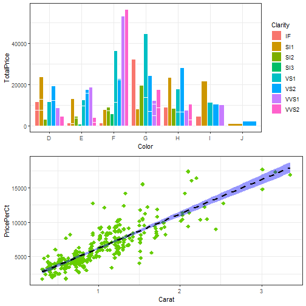

========================================================
font-import: https://fonts.googleapis.com/css2?family=Kanit:wght@300&display=swap
font-family: 'Kanit'
css: style.css
 

HTML PRESENTATION: DIAMONDS DATAFRAME

Marta Ilundain Martínez

Diamonds DataFrame
========================================================
type: slide

In this presentation we will make an analysis of the dataset Diamonds, from the Stat2Data package.
 
 
This dataframe contains 351 observations. The variables we have in this dataset are:

<li class="fragment fade-in">Carat: numeric variable, corresponds to the size of the diamond (in carats, one carat is equivalent to 200mg)</li>
<li class="fragment fade-in">Color: coded as D (most white/bright) through J</li>
<li class="fragment fade-in">Clarity: coded as IF, VVS1, VVS2, VS1, VS2, SI1, SI2, or SI3</li>
<li class="fragment fade-in">Depth: depth (as a percentage of diameter)</li>
<li class="fragment fade-in">PricePerCt: price per carat</li>
<li class="fragment fade-in">TotalPrice: price for the diamond (in dollars)</li>

Summary of the variables
========================================================
type: slide

Next, we have two tables, the first one contains the summary of the numerical variables and the second one the summary of the categorical variables: 

<table class="table" style="margin-left: auto; margin-right: auto;">
 <thead>
  <tr>
   <th style="text-align:left;">   </th>
   <th style="text-align:left;">  </th>
   <th style="text-align:left;">  </th>
   <th style="text-align:left;">  </th>
   <th style="text-align:left;">  </th>
   <th style="text-align:left;">  </th>
   <th style="text-align:left;">  </th>
  </tr>
 </thead>
<tbody>
  <tr>
   <td style="text-align:left;"> Carat </td>
   <td style="text-align:left;"> Min.   :0.3100 </td>
   <td style="text-align:left;"> 1st Qu.:0.7000 </td>
   <td style="text-align:left;"> Median :0.9000 </td>
   <td style="text-align:left;"> Mean   :0.9995 </td>
   <td style="text-align:left;"> 3rd Qu.:1.2400 </td>
   <td style="text-align:left;"> Max.   :3.3500 </td>
  </tr>
  <tr>
   <td style="text-align:left;"> Depth </td>
   <td style="text-align:left;"> Min.   :58.20 </td>
   <td style="text-align:left;"> 1st Qu.:61.20 </td>
   <td style="text-align:left;"> Median :62.00 </td>
   <td style="text-align:left;"> Mean   :64.39 </td>
   <td style="text-align:left;"> 3rd Qu.:68.55 </td>
   <td style="text-align:left;"> Max.   :79.20 </td>
  </tr>
  <tr>
   <td style="text-align:left;"> PricePerCt </td>
   <td style="text-align:left;"> Min.   : 1755 </td>
   <td style="text-align:left;"> 1st Qu.: 4185 </td>
   <td style="text-align:left;"> Median : 5346 </td>
   <td style="text-align:left;"> Mean   : 6242 </td>
   <td style="text-align:left;"> 3rd Qu.: 7762 </td>
   <td style="text-align:left;"> Max.   :17672 </td>
  </tr>
  <tr>
   <td style="text-align:left;"> TotalPrice </td>
   <td style="text-align:left;"> Min.   :  544.1 </td>
   <td style="text-align:left;"> 1st Qu.: 2832.8 </td>
   <td style="text-align:left;"> Median : 4762.8 </td>
   <td style="text-align:left;"> Mean   : 7450.0 </td>
   <td style="text-align:left;"> 3rd Qu.: 9340.9 </td>
   <td style="text-align:left;"> Max.   :56454.4 </td>
  </tr>
</tbody>
</table>

<table class="table" style="margin-left: auto; margin-right: auto;">
 <thead>
  <tr>
   <th style="text-align:left;">   </th>
   <th style="text-align:left;">  </th>
   <th style="text-align:left;">  </th>
   <th style="text-align:left;">  </th>
   <th style="text-align:left;">  </th>
   <th style="text-align:left;">  </th>
   <th style="text-align:left;">  </th>
   <th style="text-align:left;">  </th>
  </tr>
 </thead>
<tbody>
  <tr>
   <td style="text-align:left;"> Color </td>
   <td style="text-align:left;"> D:52 </td>
   <td style="text-align:left;"> E:82 </td>
   <td style="text-align:left;"> F:87 </td>
   <td style="text-align:left;"> G:86 </td>
   <td style="text-align:left;"> H:29 </td>
   <td style="text-align:left;"> I:12 </td>
   <td style="text-align:left;"> J: 3 </td>
  </tr>
  <tr>
   <td style="text-align:left;"> Clarity </td>
   <td style="text-align:left;"> VS1    :122 </td>
   <td style="text-align:left;"> VS2    : 93 </td>
   <td style="text-align:left;"> SI1    : 41 </td>
   <td style="text-align:left;"> VVS2   : 35 </td>
   <td style="text-align:left;"> VVS1   : 31 </td>
   <td style="text-align:left;"> IF     : 16 </td>
   <td style="text-align:left;"> (Other): 13 </td>
  </tr>
</tbody>
</table>

Plots of the data
========================================================
type: slide

In the next three slides we will see some plots of our data. First, with ggplot we can see the main characteristics of the Diamonds dataset:

Plots of the data
========================================================
type: slide

<iframe src="carat.html" style="display:block;position:absolute;height:100%;width:100%"></iframe>

***

Plots of the data
========================================================
type: slide

<iframe src="demo2.html" style="position:absolute;height:100%;width:100%"></iframe>

